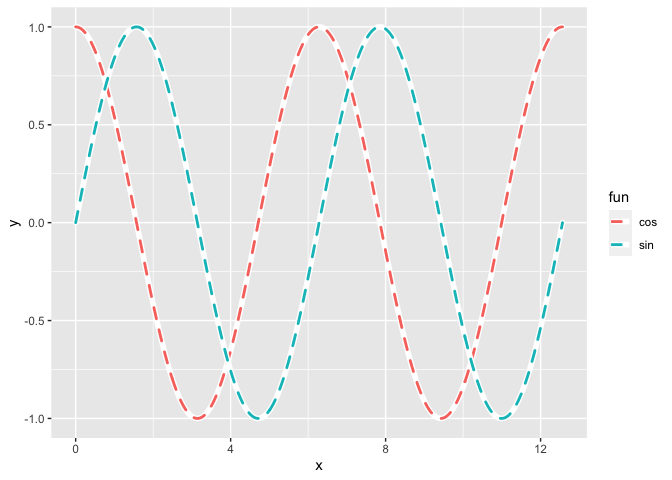

<!-- README.md is generated from README.Rmd. Please edit that file -->

# ggborderline

<!-- badges: start -->
<!-- badges: end -->

{ggborderline} provides a set of geoms to make line plots a little bit
nicer. Use this package along with
[ggplot2](https://ggplot2.tidyverse.org/) to:

-   Improve the clarity of line plots with many overlapping lines
-   Draw more realistic worms

# Installation

You can install the development version of ggborderline from
[github](https://github.com/wurli/ggborderline) with:

``` r
remotes::install_github("wurli/ggborderline")
```

## Usage

Here is a very basic line plot

``` r
library(ggborderline)
library(ggplot2)

# geom_borderline() adds a border around lines
ggplot(economics_long, aes(date, value01, colour = variable)) +
  geom_borderline()
```


``` r
# You can control the size and colour of the border with the
# border_size and border_colour aesthetics:
ggplot(economics_long, aes(date, value01, border_colour = variable)) +
  geom_borderline(border_size = .4, colour = "white")
```


``` r
# The background 'border' part of the geom is always solid, however this
# can be used to create some nice effects:
x <- seq(0, 4 * pi, length.out = 500)
test_data <- data.frame(
  x = rep(x, 2), y = c(sin(x), cos(x)),
  fun = rep(c("sin", "cos"), each = 500)
)

ggplot(test_data, aes(x, y, colour = fun)) +
  geom_borderline(size = 1, linetype = "dashed", lineend = "round")
```



<details>
<summary>
Click here for hyper-realistic worms
</summary>

</details>

# Inspiration

I made this package after seeing this *beautiful* plot by [Rosamund
Pearce](https://twitter.com/_rospearce):
<blockquote class="twitter-tweet">
<p lang="en" dir="ltr">
I designed my first double-page
<a href="https://twitter.com/hashtag/dataviz?src=hash&amp;ref_src=twsrc%5Etfw">\#dataviz</a>
for The Economist!<br><br>It depicts our new ‘Normalcy index’, which
tracks the world's return to pre-pandemic life &gt;&gt;
<a href="https://t.co/Iko6totfJN">https://t.co/Iko6totfJN</a>
<a href="https://t.co/1sIUMoZco1">pic.twitter.com/1sIUMoZco1</a>
</p>
— Rosamund Pearce (@\_rospearce)
<a href="https://twitter.com/_rospearce/status/1410903833442717698?ref_src=twsrc%5Etfw">July
2, 2021</a>
</blockquote>
<script async src="https://platform.twitter.com/widgets.js" charset="utf-8"></script>

# Credit

This package would not have been possible without the fantastic
[ggplot2](https://ggplot2.tidyverse.org/) package, and would have been
very difficult without the [accompanying
book](https://ggplot2-book.org/). My humble and sincere thanks go to all
the authors who make projects like this possible.
