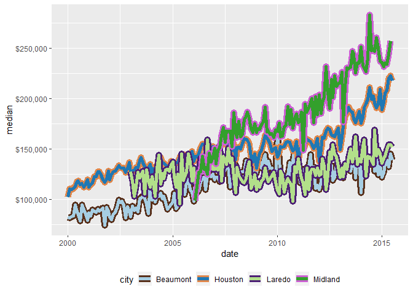

# ggborderline 

<!-- README.md is generated from README.Rmd. Please edit that file -->
<!-- badges: start -->

[](https://github.com/wurli/ggborderline/actions)
<!-- badges: end -->

{ggborderline} provides a set of geoms to make line plots a little bit
nicer. Use this package along with
[ggplot2](https://ggplot2.tidyverse.org/) to:

-   Improve the clarity of line plots with many overlapping lines
-   Draw more realistic worms

## Usage

Simply changing `ggplot2::geom_line()` for `geom_borderline()` can make
a big difference:

``` r
library(ggborderline)
library(ggplot2)
library(dplyr, warn.conflicts = FALSE)
library(patchwork)

plot <- economics_long %>% 
  group_by(year = lubridate::year(date), variable) %>% 
  summarise(yearly_total = sum(value01), .groups = "drop") %>% 
  filter(year %in% 1970:2010) %>% 
  ggplot(aes(year, yearly_total, colour = variable)) +
  theme(legend.position = "bottom")

plot + geom_borderline() + ggtitle("Using `geom_borderline()`")
plot + geom_line() + ggtitle("Using `geom_line()`")
```


<details>
<summary>
Click here for more uses
</summary>



[Click here for worm
code](https://github.com/wurli/ggborderline/blob/main/README.Rmd)

</details>

# Installation

You can install the development version of ggborderline from
[github](https://github.com/wurli/ggborderline) with:

``` r
remotes::install_github("wurli/ggborderline")
```

# Inspiration

I made this package after seeing this plot tweeted by [Rosamund
Pearce](https://twitter.com/_rospearce), an experience that forever
soured me to lines without borders:
<blockquote class="twitter-tweet">
<p lang="en" dir="ltr">
I designed my first double-page
<a href="https://twitter.com/hashtag/dataviz?src=hash&amp;ref_src=twsrc%5Etfw">\#dataviz</a>
for The Economist!<br><br>It depicts our new ‘Normalcy index’, which
tracks the world's return to pre-pandemic life &gt;&gt;
<a href="https://t.co/Iko6totfJN">https://t.co/Iko6totfJN</a>
<a href="https://t.co/1sIUMoZco1">pic.twitter.com/1sIUMoZco1</a>
</p>
— Rosamund Pearce (@\_rospearce)
<a href="https://twitter.com/_rospearce/status/1410903833442717698?ref_src=twsrc%5Etfw">July
2, 2021</a>
</blockquote>
<script async src="https://platform.twitter.com/widgets.js" charset="utf-8"></script>

# Credit

This package would not have been possible without the fantastic
[ggplot2](https://ggplot2.tidyverse.org/) package, and would have been
very difficult without the [accompanying
book](https://ggplot2-book.org/). My humble and sincere thanks go to all
the authors who make projects like this possible.
