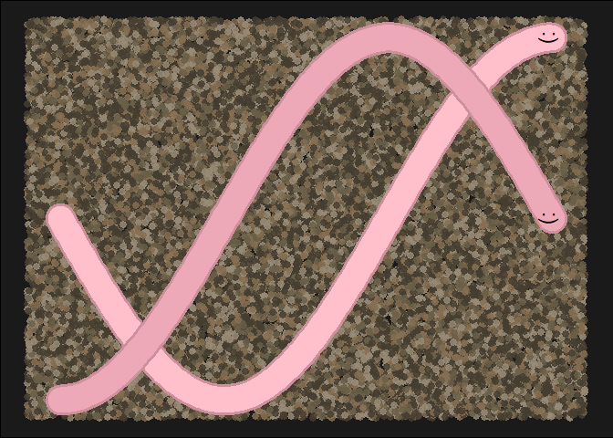

# ggborderline 

<!-- README.md is generated from README.Rmd. Please edit that file -->
<!-- badges: start -->

[](https://github.com/wurli/ggborderline/actions)
[](https://CRAN.R-project.org/package=ggborderline)
<!-- badges: end -->

{ggborderline} provides a set of geoms to make line plots a little bit
nicer. Use this package along with
[ggplot2](https://ggplot2.tidyverse.org/) to:

-   Improve the clarity of line plots with many overlapping lines
-   Draw more realistic worms

## Usage

You can use ggborderline by swapping out {ggplot2} line geoms with their
‘`border`’ equivalents. For example, here is the effect of swapping
`ggplot2::geom_line()` for `geom_borderline()`. Notice the white outline
of lines in the first plot where different lines intersect:

``` r
library(ggborderline)
library(ggplot2)
library(dplyr, warn.conflicts = FALSE)

plot <- economics_long %>% 
  group_by(year = lubridate::year(date), variable) %>% 
  summarise(yearly_total = sum(value01), .groups = "drop") %>% 
  filter(year %in% 1970:2010) %>% 
  ggplot(aes(year, yearly_total, colour = variable)) +
  theme(legend.position = "bottom")

plot + geom_borderline() + ggtitle("Using `geom_borderline()`")
plot + geom_line() + ggtitle("Using `geom_line()`")
```


This effect is best applied conservatively, hence the ‘default’ settings
will only make a subtle (but hopefully positive) difference to existing
plots. However you can still adjust the `bordersize` and `bordercolour`
aesthetics. Notice that the border is also much more noticable in the
legend too:

``` r
library(ggdark)

plot + 
  geom_borderline(
    aes(bordercolour = after_scale(invert_colour(colour))),
    bordersize = 1, size = 2
  )
```


<details>
<summary>
Click here for more uses
</summary>



[Worm code](https://github.com/wurli/ggborderline/blob/main/README.Rmd)

</details>

# Installation

You can install the released version of ggborderline from CRAN with:

``` r
install.packages("ggborderline")
```

The development version of ggborderline can be installed from
[github](https://github.com/wurli/ggborderline) with:

``` r
remotes::install_github("wurli/ggborderline")
```

# Inspiration

I made this package after seeing this plot tweeted by [Rosamund
Pearce](https://twitter.com/_rospearce), an experience that forever
soured me to lines without borders:
<blockquote class="twitter-tweet">
<p lang="en" dir="ltr">
I designed my first double-page
<a href="https://twitter.com/hashtag/dataviz?src=hash&amp;ref_src=twsrc%5Etfw">\#dataviz</a>
for The Economist!<br><br>It depicts our new ‘Normalcy index’, which
tracks the world's return to pre-pandemic life &gt;&gt;
<a href="https://www.economist.com/graphic-detail/2021/07/03/our-normalcy-index-shows-life-is-halfway-back-to-pre-covid-norms">https://www.economist.com/graphic-detail/2021/07/03/our-normalcy-index-shows-life-is-halfway-back-to-pre-covid-norms</a>
<a href="https://twitter.com/_rospearce/status/1410903833442717698/photo/1">pic.twitter.com/1sIUMoZco1</a>
</p>
— Rosamund Pearce (@\_rospearce)
<a href="https://twitter.com/_rospearce/status/1410903833442717698?ref_src=twsrc%5Etfw">July
2, 2021</a>
</blockquote>
<script async src="https://platform.twitter.com/widgets.js" charset="utf-8"></script>

# Other Approaches

While these effects can be achieved using {ggplot2} alone if you have
the patience, there are other packages which provide other methods for
achieving bordered lines. [{ggfx}](https://ggfx.data-imaginist.com/) is
much more powerful, but would perhaps be overkill for something as
simple as adding a border around a line.
[{ggshadow}](https://github.com/marcmenem/ggshadow) is another great
alternative which implements the shadow using a slightly different
approach, and also comes with some other handy features. You are
encouraged to try both!

# Credit

This package would not have been possible without the fantastic
[ggplot2](https://ggplot2.tidyverse.org/) package, and would have been
very difficult without the [accompanying
book](https://ggplot2-book.org/). My humble and sincere thanks go to all
the authors and developers who make projects like this possible.
